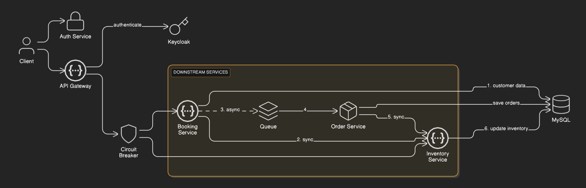

# Ticket Buying System


Microservices-based ticket booking application with event inventory management, booking processing, and order management.



## Features

- Event inventory management
- Venue capacity tracking
- Real-time inventory updates
- Ticket booking creation
- Kafka event publishing and consumption
- Order creation and persistence
- Inventory service integration
- MySQL database storage and integration
- Flyway database migrations
- Event-driven architecture
- Service routing and load balancing
- OAuth2 JWT authentication
- Circuit breaker with Resilience4j
- OpenAPI documentation (individual and aggregated)
- Global exception handling
- Input validation with Bean Validation
- Health monitoring with Spring Boot Actuator
- Metrics and monitoring with Spring Boot Actuator and Prometheus

## Architecture

- **Inventory Service:** Port 8080
- **Booking Service:** Port 8081
- **Order Service:** Port 8082
- **API Gateway:** Port 8090

## Quick Start

1. Start MySQL database
2. Start Kafka broker
3. Start Keycloak (for authentication)
4. Run each service:
   ```bash
   cd inventoryservice && mvn spring-boot:run
   cd bookingservice && mvn spring-boot:run
   cd orderservice && mvn spring-boot:run
   cd apigateway && mvn spring-boot:run
   ```

```

## Environment Variables

Set the following environment variables:

* `MYSQL_USER`: MySQL username
* `MYSQL_PASSWORD`: MySQL password

## API Endpoints

* **Inventory Service**

  * `GET /api/v1/inventory/events` - Get all events
  * `GET /api/v1/inventory/venue/{venueId}` - Get venue information
  * `GET /api/v1/inventory/event/{eventId}` - Get event inventory
  * `PUT /api/v1/inventory/event/{eventId}/capacity/{capacity}` - Update event capacity

* **Booking Service**

  * `POST /api/v1/booking` - Create a new booking

* **Order Service**

  * Processes orders via Kafka events from Booking Service (no REST endpoints)

* **API Gateway**

  * Routes booking requests to Booking Service
  * Routes inventory requests to Inventory Service
  * Provides aggregated API documentation
  * Health check endpoints via Actuator

## Metrics and Monitoring

All services use Spring Boot Actuator:

* **Inventory Service:**

  * Health: `http://localhost:8080/actuator/health`
  * Metrics: `http://localhost:8080/actuator/metrics`

* **Booking Service:**

  * Health: `http://localhost:8081/actuator/health`
  * Metrics: `http://localhost:8081/actuator/metrics`

* **Order Service:**

  * Health: `http://localhost:8082/actuator/health`
  * Metrics: `http://localhost:8082/actuator/metrics`

* **API Gateway:**

  * Health: `http://localhost:8090/actuator/health`
  * Metrics: `http://localhost:8090/actuator/metrics`

Prometheus can scrape metrics from all services and Grafana can visualize them.

## API Documentation

* Centralized via API Gateway: `http://localhost:8090/swagger-ui.html`
* Inventory Service: `http://localhost:8080/swagger-ui.html`
* Booking Service: `http://localhost:8081/swagger-ui.html`
```
