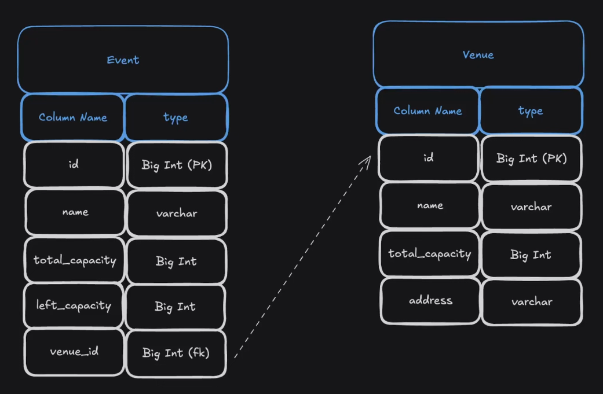

# Inventory Service

Spring Boot microservice for event inventory management.



## Features

- Event inventory management
- Venue capacity tracking
- Real-time inventory updates
- MySQL database integration
- Flyway database migrations
- OpenAPI documentation
- Global exception handling
- Input validation with Bean Validation
- Metrics and monitoring with Spring Boot Actuator and Prometheus

## API Endpoints

- `GET /api/v1/inventory/events` - Get all events
- `GET /api/v1/inventory/venue/{venueId}` - Get venue information
- `GET /api/v1/inventory/event/{eventId}` - Get event inventory
- `PUT /api/v1/inventory/event/{eventId}/capacity/{capacity}` - Update event capacity

## Quick Start

1. Set environment variables:

   - `MYSQL_USER`
   - `MYSQL_PASSWORD`

2. Run the service:

   ```bash
   mvn spring-boot:run
   ```

3. Access API documentation:
   http://localhost:8080/swagger-ui.html

## Missing Features

- Authentication and authorization
- Unit and integration tests
- Health checks
- Rate limiting
- Caching

## Metrics and Monitoring

This service uses Spring Boot Actuator for health checks and metrics.

- Health endpoint: `http://localhost:8080/actuator/health`
- Metrics endpoint: `http://localhost:8080/actuator/metrics`

For advanced monitoring, Prometheus can scrape metrics and Grafana can visualize them.
